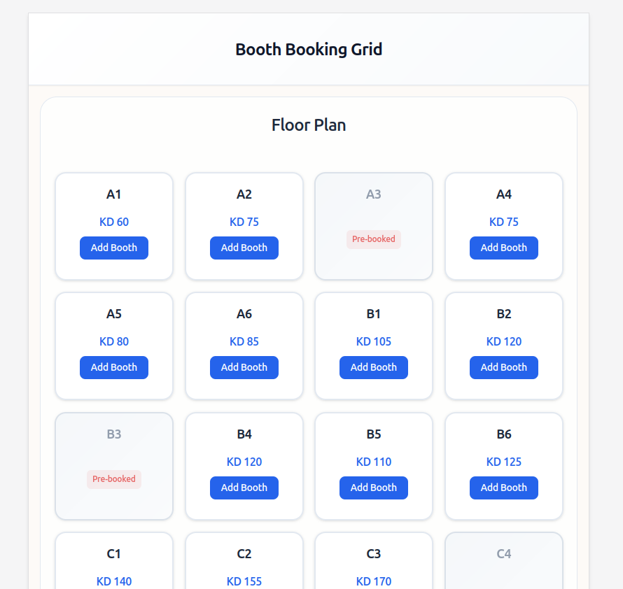

# Booth Booking Grid

A responsive, interactive floor plan for booth booking at events and exhibitions. Built with vanilla HTML, CSS, and JavaScript.


## 🎯 Overview

This project creates an intuitive booth booking system where users can:
- View an interactive floor plan with available booths
- Hover over booths to see pricing and booking options
- Add/remove booths from their cart
- See real-time total price calculations
- Handle pre-booked booths appropriately

## 📱 Features

### Core Functionality
- **Interactive Floor Plan**: 6x6 grid layout with labeled booths (A1-F6)
- **Hover Effects**: Price and "Add Booth" button appear on hover (desktop)
- **Always Visible Info**: Touch-friendly design for tablets and mobile
- **Shopping Cart**: Add, remove, and clear booth selections
- **Real-time Updates**: Total price updates without page reload
- **Pre-booked Handling**: Some booths are disabled and visually distinct

### Responsive Design
- **Desktop (>1024px)**: Side-by-side layout with hover effects
- **Tablet (≤1024px)**: Stacked layout with always-visible booth info
- **Mobile (≤768px)**: Optimized cards and vertical cart layout

### Accessibility
- Semantic HTML structure (`<header>`, `<main>`, `<section>`, `<article>`)
- ARIA labels for screen readers
- Keyboard navigation support
- Focus indicators for all interactive elements

## 🛠️ Technical Implementation

### Project Structure
```
booth-booking-grid/
├── index.html          # Main HTML structure
├── style.css           # All styling and responsive design
├── app.js             # Interactive functionality
├── README.md          # This documentation
└── images/            # Screenshots and previews
    ├── desktop-preview.png
    ├── tablet-preview.png
    └── mobile-preview.png
```

### HTML Structure
- **Semantic Elements**: Proper use of `<header>`, `<main>`, `<section>`, `<article>`
- **Accessibility**: ARIA labels, proper labeling for booth states
- **Clean Markup**: No inline styles, organized structure

### CSS Architecture
- **Design System**: CSS custom properties for consistent theming
- **Mobile-First**: Responsive design with progressive enhancement
- **Performance**: Optimized transitions and hover effects
- **Professional Design**: Modern glass-morphism and subtle animations

### JavaScript Features
- **Module Pattern**: IIFE to avoid global variable pollution
- **Event Delegation**: Efficient event handling for dynamic content
- **DOM Manipulation**: Safe element creation without innerHTML
- **Error Handling**: Null checks and graceful fallbacks

## 💾 Data Structure

### Booth Data (HTML-based)
```html
<article class="booth" data-booth="A1" data-price="60">
<article class="booth pre-booked" data-booth="A3" data-price="90">
```

### Cart Array
```javascript
[
    { id: "A1", price: 60 },
    { id: "B3", price: 85 }
    // ... more selected booths
]
```

## 🎨 Design Choices

### Color Scheme
- **Primary**: Blue (#2563eb) for interactive elements
- **Success**: Green (#059669) for selected booths
- **Danger**: Red (#dc2626) for pre-booked/remove actions
- **Neutral**: Gray scale for backgrounds and text

### Typography
- **Font**: Inter with system font fallbacks
- **Scale**: Consistent sizing system (xs to 3xl)
- **Weight**: Strategic use of font weights for hierarchy

### Currency
- **KWD (Kuwaiti Dinar)**: As requested for local market

## 📸 Screenshots

### Desktop View


### Tablet View


### Mobile View


## 🚀 Getting Started

1. **Clone or Download** the project files
2. **Open** `index.html` in a modern web browser
3. **Interact** with the booth grid:
   - Hover over available booths (desktop)
   - Click "Add Booth" to add to cart
   - Use "Remove" buttons to remove individual items
   - Click "Clear Cart" to empty the cart

## ⚡ Performance Optimizations

- **CSS**: Simplified transitions, optimized selectors
- **JavaScript**: Event delegation, minimal DOM queries
- **Images**: Placeholder structure ready for optimized images
- **Loading**: Fast initial render with efficient CSS

## 🔧 Browser Support

- **Modern Browsers**: Chrome, Firefox, Safari, Edge (last 2 versions)
- **Mobile**: iOS Safari, Chrome Mobile
- **Accessibility**: Screen readers, keyboard navigation

## 🎯 Assumptions Made

1. **Currency**: Used Kuwaiti Dinar (KWD) as appropriate for the region
2. **Booth Layout**: 6x6 grid provides good balance of content and usability
3. **Pricing**: Varied prices (60-120 KWD) for realistic scenario
4. **Pre-booked Booths**: ~15% of booths are pre-booked for realism
5. **Mobile Behavior**: Always-visible info for better touch experience

## 🚧 Future Improvements

With more time, I would enhance:

### Functionality
- **Booth Categories**: Premium, standard, economy sections
- **Date Selection**: Multi-day event booking
- **User Authentication**: Save carts and booking history
- **Payment Integration**: Secure checkout process
- **Admin Panel**: Manage booth availability and pricing

### Technical
- **State Management**: More robust state handling for complex scenarios
- **API Integration**: Backend for data persistence
- **Testing**: Unit tests for JavaScript functions
- **Build Process**: CSS/JS minification and optimization
- **Progressive Web App**: Offline functionality

### UX/UI
- **Animations**: More sophisticated micro-interactions
- **Search/Filter**: Find booths by location, price, or size
- **3D Floor Plan**: Interactive 3D visualization
- **Comparison Tool**: Side-by-side booth comparison
- **Accessibility**: Enhanced screen reader support

### Performance
- **Lazy Loading**: Dynamic booth loading for large venues
- **Caching**: Browser and service worker caching
- **Image Optimization**: WebP format with fallbacks
- **Bundle Splitting**: Separate critical and non-critical CSS/JS

## 🏆 Requirements Checklist

### ✅ Core Requirements
- [x] Plain HTML, CSS, JavaScript (no frameworks)
- [x] Sectioned floor plan with rows/columns
- [x] Booth labels (A1, A2, etc.)
- [x] Hover reveals price and "Add Booth" button
- [x] Add booths to cart on same page
- [x] Update total price without reload
- [x] Pre-booked booths (disabled, visually distinct)
- [x] Multiple booth selection

### ✅ HTML Requirements
- [x] Semantic structure (`<header>`, `<main>`, `<section>`, `<article>`, `<button>`)
- [x] Accessible labels for each booth
- [x] ARIA labels where needed

### ✅ JavaScript Requirements
- [x] Add booths to cart
- [x] Update cart items and total
- [x] Prevent adding pre-booked booths
- [x] Allow removal from cart

### ✅ Nice-to-Have Features
- [x] Prevent duplicate booth booking
- [x] Small hover animations
- [x] Responsive design
- [x] Professional styling

### ✅ Deliverables
- [x] index.html (with style.css and app.js)
- [x] README.md with required explanations
- [x] What was built & assumptions
- [x] Data structure overview
- [x] Future improvements

## 📄 License

This project is created as a technical assessment and is available for review and evaluation purposes.
